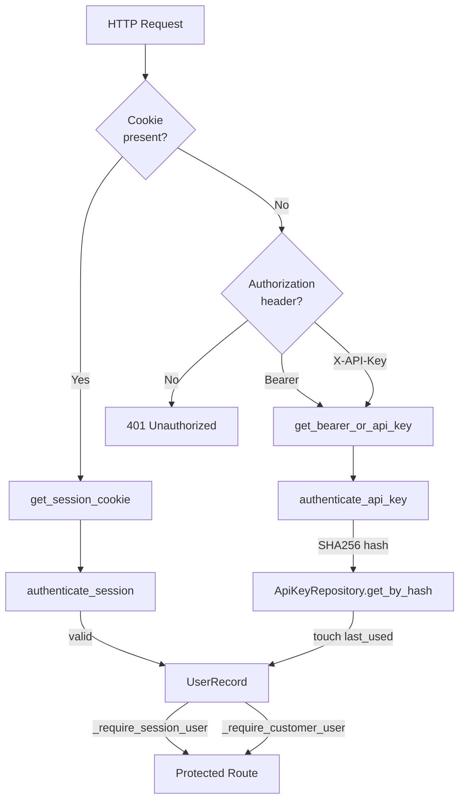
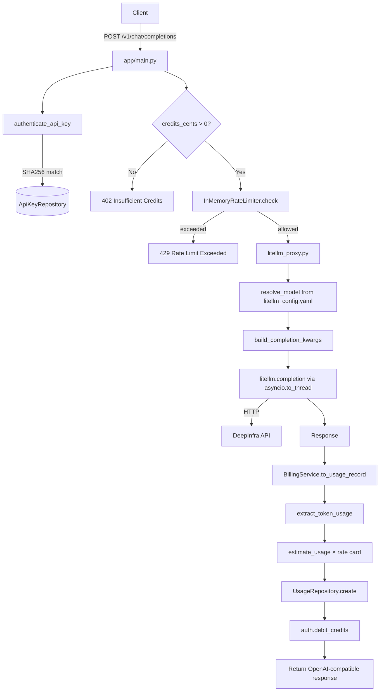
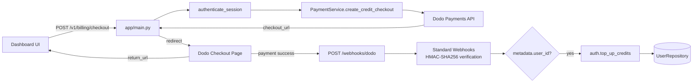
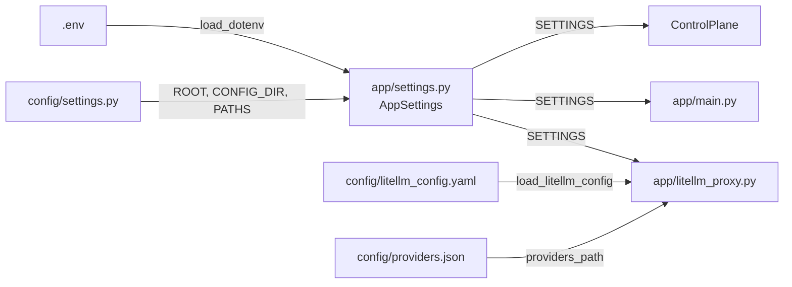

# OpenRouter OSS — Architecture

## Overview

A self-hostable OpenAI-compatible API proxy that provides model routing, API key management, credit-based billing, and a customer dashboard. Built with FastAPI, LiteLLM, and PostgreSQL.

---

## Directory Structure

```
openrouter-oss/
├── main.py                          # Entry point: runs uvicorn on app.main:app
├── pyproject.toml                   # Python deps & project metadata
├── requirements.txt                 # Flat pip deps
├── AGENTS.md                        # AI agent UI development guidelines
├── RTK.md                           # Additional dev guidelines
├── README.md
├── .env.example
├── .python-version
├── uv.lock
│
├── config/                          # Static configuration
│   ├── settings.py                  # ConfigPaths: ROOT, CONFIG_DIR, PATHS (litellm_config, providers)
│   ├── litellm_config.yaml          # Model routing definitions (model → provider mapping)
│   └── providers.json               # Provider metadata
│
├── app/                             # Main application package
│   ├── main.py                      # FastAPI app: all 17 routes, cookie helpers, auth guards
│   ├── settings.py                  # AppSettings: all env-driven config (DB, Redis, Dodo, etc.)
│   ├── control_plane.py             # ControlPlane: dependency injection composition root
│   ├── db.py                        # PostgreSQL connection + cursor context managers
│   ├── ui.py                        # Server-rendered HTML: landing, login, signup, dashboard
│   ├── litellm_proxy.py             # LiteLLM adapter: config loading, model resolution, proxy call
│   │
│   ├── models/
│   │   ├── __init__.py              # Re-exports all models
│   │   ├── control.py               # Internal dataclasses: UserRecord, SessionRecord, ApiKeyRecord, UsageRecord, RateLimitDecision
│   │   └── schemas.py               # Pydantic schemas: request/response models for all routes
│   │
│   ├── services/
│   │   ├── __init__.py              # Re-exports: AuthService, BillingService, PaymentService, InMemoryRateLimiter
│   │   ├── auth.py                  # AuthService: register, login, session mgmt, API key CRUD, credit top-up/debit
│   │   ├── billing.py               # BillingService: rate card, token → cost estimation
│   │   ├── payments.py              # PaymentService: Dodo Payments checkout sessions
│   │   └── rate_limit.py            # InMemoryRateLimiter: sliding window per-user
│   │
│   ├── repositories/
│   │   ├── __init__.py              # Re-exports: UserRepository, InMemoryUserRepository, UsageRepository, InMemoryUsageRepository
│   │   ├── users.py                 # UserRepository (Protocol) + InMemoryUserRepository + PostgresUserRepository + build_user_repository
│   │   ├── sessions.py              # SessionRepository (Protocol) + InMemorySessionRepository + PostgresSessionRepository + build_session_repository
│   │   ├── api_keys.py              # ApiKeyRepository (Protocol) + InMemoryApiKeyRepository + PostgresApiKeyRepository + build_api_key_repository
│   │   └── usage.py                 # UsageRepository (Protocol) + InMemoryUsageRepository + PostgresUsageRepository + build_usage_repository
│   │
│   ├── middleware/
│   │   ├── __init__.py              # Package marker
│   │   ├── auth.py                  # get_bearer_or_api_key(), get_session_cookie()
│   │   ├── billing.py               # Older billing helpers (legacy)
│   │   └── caching.py               # CacheSettings + CacheBackend (in-memory)
│   │
│   └── routes/                      # Reserved for future route separation
│       └── __init__.py
│
├── migrations/
│   ├── 001_init.sql                 # users + usage_logs tables
│   └── 002_auth_sessions_api_keys.sql  # password fields, sessions, api_keys
│
├── docker/
│   ├── Dockerfile                   # Python 3.12-slim + uvicorn
│   └── docker-compose.yml           # redis + postgres + app
│
├── tests/
│   ├── test_app.py                  # litellm_proxy unit tests
│   ├── test_control_plane.py        # Auth, rate limiter, billing, usage tests
│   ├── test_customer_flow.py        # E2E: register → create key → chat completion
│   └── test_ui.py                   # HTML content checks for rendered pages
│
└── tools/
    └── tailscale_port_proxy.py      # TCP proxy bound to Tailscale IP
```

---

## Tech Stack

| Layer | Technology |
|-------|-----------|
| Runtime | Python 3.12+ |
| Web framework | FastAPI 0.136+ |
| Server | Uvicorn |
| LLM proxy | LiteLLM 1.87+ |
| Database | PostgreSQL 16 (psycopg2-binary) |
| Cache | Redis 8+ (defined, not heavily used) |
| Payments | Dodo Payments SDK + Standard Webhooks (webhook verification) |
| Auth | Custom: PBKDF2 (password), SHA256 (tokens) |
| Testing | pytest |
| Containerization | Docker + docker-compose |
| UI | Server-rendered HTML (no JS framework) |

---

## Module Dependency Graph

```
                            ┌──────────────┐
                            │  main.py     │
                            │  (uvicorn)   │
                            └──────┬───────┘
                                   │ imports
                                   ▼
┌──────────────────────────────────────────────────────────────────┐
│                      app/main.py                                 │
│  (17 route handlers — the HTTP layer)                            │
├──────────────────────────────────────────────────────────────────┤
│ imports:                                                         │
│   app.control_plane       → CONTROL_PLANE (DI root)              │
│   app.litellm_proxy       → proxy_chat_completion, etc.          │
│   app.middleware.auth     → get_bearer_or_api_key,               │
│                              get_session_cookie                  │
│   app.models              → all Pydantic schemas                 │
│   app.services.auth       → AuthenticationError, RegistrationError│
│   app.settings            → SETTINGS                             │
│   app.ui                  → render_*_page() functions            │
└──────────────────────────────────────────────────────────────────┘
          │
          │ depends on
          ▼
┌──────────────────────────────────────────────────────────────────┐
│                   app/control_plane.py                           │
│  (Composition root — wires all dependencies)                    │
├──────────────────────────────────────────────────────────────────┤
│ builds and holds:                                                │
│   auth: AuthService             ← services/auth.py               │
│   billing: BillingService       ← services/billing.py            │
│   payments: PaymentService      ← services/payments.py           │
│   rate_limiter: InMemoryRateLimiter ← services/rate_limit.py     │
│   users: UserRepository         ← repositories/users.py          │
│   sessions: SessionRepository   ← repositories/sessions.py       │
│   api_keys: ApiKeyRepository    ← repositories/api_keys.py       │
│   usage: UsageRepository        ← repositories/usage.py          │
└──────────────────────────────────────────────────────────────────┘
          │
          ├──────────────────────────┬──────────────────────┐
          ▼                          ▼                      ▼
┌────────────────────┐   ┌────────────────────┐   ┌────────────────────┐
│   services/        │   │   repositories/    │   │   models/          │
│   auth.py          │──►│   users.py         │   │   control.py       │
│   billing.py       │   │   sessions.py      │   │   (dataclasses)    │
│   payments.py      │   │   api_keys.py      │   │   schemas.py       │
│   rate_limit.py    │   │   usage.py         │   │   (Pydantic)       │
└────────────────────┘   └────────┬───────────┘   └────────────────────┘
                                  │
                                  ▼
                        ┌────────────────────┐
                        │   app/db.py        │
                        │   (PostgreSQL)     │
                        └────────────────────┘
```

---

## Layered Architecture

### 1. Models Layer — `app/models/`

Pure data structures with no business logic.

| File | Contents |
|------|----------|
| `control.py` | Frozen dataclasses: `UserRecord`, `SessionRecord`, `ApiKeyRecord`, `UsageRecord`, `RateLimitDecision` |
| `schemas.py` | Pydantic `BaseModel` schemas: request validation (`RegisterRequest`, `ChatCompletionRequest`, `CheckoutRequest`) + response serialization (`AccountResponse`, `ApiKeyCreatedResponse`, `UsageResponse`) |

### 2. Repository Layer — `app/repositories/`

Data access layer using the **Repository pattern** with Protocol interfaces and dual implementations.

Each repository defines a `Protocol` interface, then provides:
- **InMemory*Repository** — dict-backed, used when PostgreSQL is unavailable (dev/fallback)
- **Postgres*Repository** — production implementation via psycopg2
- **build_*_repository()** — factory that tries PostgreSQL first, falls back to in-memory

| File | Protocol | InMemory | Postgres | Factory |
|------|----------|----------|----------|---------|
| `users.py` | `UserRepository` | `InMemoryUserRepository` | `PostgresUserRepository` | `build_user_repository()` |
| `sessions.py` | `SessionRepository` | `InMemorySessionRepository` | `PostgresSessionRepository` | `build_session_repository()` |
| `api_keys.py` | `ApiKeyRepository` | `InMemoryApiKeyRepository` | `PostgresApiKeyRepository` | `build_api_key_repository()` |
| `usage.py` | `UsageRepository` | `InMemoryUsageRepository` | `PostgresUsageRepository` | `build_usage_repository()` |

### 3. Service Layer — `app/services/`

Business logic orchestration.

| Service | File | Responsibilities |
|---------|------|-----------------|
| `AuthService` | `auth.py` | Register, login, logout, session authentication, API key CRUD (create/list/revoke), credit top-up/debit, password hashing (PBKDF2, 120k iterations) |
| `BillingService` | `billing.py` | Rate card definition (`MODEL_RATE_PER_MILLION_CENTS`), token usage extraction from LLM response, cost estimation |
| `PaymentService` | `payments.py` | Dodo Payments checkout session creation, credit pack mapping from env |
| `InMemoryRateLimiter` | `rate_limit.py` | Per-user sliding window rate limiter (60s), thread-safe (Lock) |

### 4. HTTP Layer — `app/main.py`

All routes defined inline. No route splitting yet (the `routes/` package exists but is empty).

#### HTML Pages

| Route | Handler | Auth | Description |
|-------|---------|------|-------------|
| `GET /` | `landing()` | — | Marketing landing page |
| `GET /login` | `login_page()` | — | Login form (redirects to `/app` if authed) |
| `GET /signup` | `signup_page()` | — | Registration form |
| `GET /app` | `app_page()` | Session (cookie) | Dashboard — redirects to `/login` if unauthed |
| `GET /ui` | `ui()` | Session | Alias for `/app` |

#### Authentication Endpoints (JSON)

| Route | Method | Handler | Description |
|-------|--------|---------|-------------|
| `/auth/register` | POST | `register()` | Create account → sets session cookie |
| `/auth/login` | POST | `login()` | Authenticate → sets session cookie |
| `/auth/logout` | POST | `logout()` | Clears session cookie |
| `/auth/me` | GET | `auth_me()` | Current user profile (session) |

#### OpenAI-Compatible API (v1)

| Route | Method | Handler | Description |
|-------|--------|---------|-------------|
| `/v1/me` | GET | `current_account()` | Profile (session or API key) |
| `/v1/models` | GET | `list_models()` | Available models from `litellm_config.yaml` |
| `/v1/api-keys` | GET | `list_api_keys()` | List user's API keys |
| `/v1/api-keys` | POST | `create_api_key()` | Create new key (returns `or_live_...` secret once) |
| `/v1/api-keys/{key_id}` | DELETE | `revoke_api_key()` | Revoke a key |
| `/v1/usage/recent` | GET | `recent_usage()` | Recent usage records (paginated) |
| `/v1/chat/completions` | POST | `chat_completions()` | **Core endpoint** — proxy to LLM, deduct credits, log usage |
| `/v1/billing/checkout` | POST | `create_checkout()` | Create Dodo Payments checkout |

#### Webhooks & Health

| Route | Method | Handler | Description |
|-------|--------|---------|-------------|
| `POST /webhooks/dodo` | POST | `dodo_webhook()` | Credit top-up on successful payment (Standard Webhooks verification) |
| `GET /health` | GET | `health()` | `{"status": "ok", "service": "OpenRouter OSS"}` |

---

## Data Flow Diagrams

### Authentication Flow



### Chat Completion Flow



### Dodo Payments Checkout Flow



---

## UI Architecture

### Server-Rendered Pages (`app/ui.py`)

```
_shell(title, body, extra_css, scripts)  ← shared HTML wrapper
├── COMMON_CSS                            ← global styles (Inter font, variables, layout, forms, tables, cards)
│
├── render_landing_page()
│   ├── Topbar (logo + nav)
│   ├── Hero (eyebanner, headline, CTA, terminal demo)
│   ├── Model Catalog (5 model cards)
│   ├── How It Works (3-step grid)
│   ├── Pricing (4 credit packs)
│   ├── FAQ (5 accordion items)
│   ├── CTA Section
│   └── Footer
│
├── render_login_page()
│   ├── Left Panel (branding, tagline)
│   └── Right Panel (email/password form, AJAX to /auth/login)
│
├── render_signup_page()
│   ├── Left Panel (branding, feature checklist)
│   └── Right Panel (name/email/password form, AJAX to /auth/register)
│
└── render_app_page()  ← Dashboard (SPA via vanilla JS)
    ├── Sidebar (logo, nav links, account chip)
    ├── Topbar (title, status, sign-out)
    └── Content sections (showSection JS toggles):
        ├── Overview (4 stat cards + recent usage table + active keys)
        ├── Credits (balance + credit pack buttons with checkout)
        ├── Models (catalog table with model IDs)
        ├── API Keys (create form + keys table + revoke buttons)
        ├── Usage (recent requests table)
        └── Quickstart (model picker + prompt input + generated code snippet + response)
```

Key characteristics:
- **No client-side framework** — vanilla HTML/CSS/JS
- **SPA-like behavior** via `showSection(name, el)` that hides/shows `.section-page` divs
- **All API calls** use `fetch()` to FastAPI endpoints
- **API key stored** in `localStorage` for the Quickstart playground
- **CSS variables** for theming (`--bg`, `--fg`, `--accent`, etc.)

---

## Database Schema

### `users` table (001_init.sql + 002_auth_sessions_api_keys.sql)
| Column | Type | Notes |
|--------|------|-------|
| `id` | UUID | PK |
| `email` | TEXT | Unique, normalized (lowercased) |
| `name` | TEXT | Nullable |
| `password_salt` | TEXT | token_urlsafe(16) |
| `password_hash` | TEXT | PBKDF2-SHA256, 120k iterations |
| `plan` | TEXT | e.g. 'free' |
| `credits_cents` | INT | Current balance |
| `rate_limit_per_minute` | INT | Per-user rate cap |
| `active` | BOOL | Soft-delete flag |
| `created_at` | TIMESTAMPTZ | |
| `updated_at` | TIMESTAMPTZ | |

### `sessions` table
| Column | Type | Notes |
|--------|------|-------|
| `token_hash` | TEXT | PK — SHA256 of session token |
| `user_id` | UUID | FK → users(id) |
| `expires_at` | TIMESTAMPTZ | Auto-expired on read |
| `created_at` | TIMESTAMPTZ | |

### `api_keys` table
| Column | Type | Notes |
|--------|------|-------|
| `id` | UUID | PK |
| `user_id` | UUID | FK → users(id) |
| `name` | TEXT | Human label |
| `prefix` | TEXT | `or_<short>` — shown in UI |
| `key_hash` | TEXT | SHA256 of full `or_live_<long>` secret |
| `active` | BOOL | |
| `created_at` | TIMESTAMPTZ | |
| `last_used_at` | TIMESTAMPTZ | Nullable |
| `revoked_at` | TIMESTAMPTZ | Nullable |

### `usage_logs` table
| Column | Type | Notes |
|--------|------|-------|
| `id` | SERIAL | PK |
| `user_id` | UUID | FK → users(id) |
| `model` | TEXT | Model name used |
| `tokens_in` | INT | |
| `tokens_out` | INT | |
| `cost_cents` | INT | Billed amount |
| `created_at` | TIMESTAMPTZ | |

---

## Key Architectural Patterns

### 1. Clean Architecture / Layered Design
```
HTTP (routes) → Service (business logic) → Repository (data access) → DB
                    ↕                          ↕
                Models (dataclasses)      Models (dataclasses)
```
Each layer depends only on the layer below it. The `ControlPlane` in `control_plane.py` is the composition root that wires everything together.

### 2. Protocol-based Repository Pattern
```python
class UserRepository(Protocol):
    def create(self, user: UserRecord) -> UserRecord: ...
    def get_by_email(self, email: str) -> UserRecord | None: ...
    # ...

# Two implementations:
@dataclass
class InMemoryUserRepository: ...
@dataclass
class PostgresUserRepository: ...

# Factory — auto-detects PostgreSQL availability:
def build_user_repository() -> UserRepository:
    try:
        with postgres_connection(): pass
    except Exception:
        return InMemoryUserRepository()
    return PostgresUserRepository()
```

### 3. Dependency Injection via ControlPlane
```python
@dataclass
class ControlPlane:
    auth: AuthService
    billing: BillingService
    payments: PaymentService
    rate_limiter: InMemoryRateLimiter
    users: UserRepository
    sessions: SessionRepository
    api_keys: ApiKeyRepository
    usage: UsageRepository

CONTROL_PLANE = ControlPlane.build()  # Singleton, built at import time
```

### 4. Dual Authentication
- **Session cookies** for browser dashboard access (`openrouter_session` cookie, SHA256-hashed)
- **Bearer token / X-API-Key header** for programmatic API access (`or_live_xxx` keys, SHA256-hashed)

### 5. LiteLLM Proxy
- Model definitions in `config/litellm_config.yaml`
- API keys resolved from environment variables (`os.environ/VAR_NAME` syntax)
- `litellm.completion()` called via `asyncio.to_thread()` to avoid blocking the event loop

### 6. Credit-based Billing
- LLM costs estimated using a rate card (`MODEL_RATE_PER_MILLION_CENTS` in `billing.py`)
- Credits deducted synchronously after each completion
- Top-ups via Dodo Payments (checkout + webhook)

---

## Configuration Flow



All runtime configuration is driven by environment variables (loaded from `.env` via `python-dotenv`). The `config/settings.py` module provides static path constants; `app/settings.py` provides the dynamic `AppSettings` dataclass.

---

## Container Architecture (docker-compose.yml)

```
┌─────────────────────────────────────────────────────┐
│  docker-compose                                     │
│                                                     │
│  ┌──────────┐    ┌──────────┐    ┌──────────────┐  │
│  │  redis   │    │ postgres │    │    app        │  │
│  │ :6379    │    │ :5432    │    │ :8000         │  │
│  │          │    │          │    │ FastAPI+uvicorn│  │
│  └──────────┘    └──────────┘    └──────────────┘  │
│       │               │               │            │
│       └───────────────┴───────────────┘            │
│                     network: oss_router_net         │
└─────────────────────────────────────────────────────┘
```

---

## Testing

| File | Scope |
|------|-------|
| `test_app.py` | `litellm_proxy` unit tests (config loading, model resolution, completion kwargs) |
| `test_control_plane.py` | Auth (register/login/logout), rate limiter, billing estimates, usage repository |
| `test_customer_flow.py` | E2E: register user → create API key → call chat completion |
| `test_ui.py` | HTML content checks: landing page has expected sections, login/signup pages have forms |

---

## Key File References

| File | Role |
|------|------|
| `main.py` | Uvicorn entry point (runs `app.main:app`) |
| `app/main.py` | FastAPI app definition, all 17 route handlers, auth guard helpers |
| `app/control_plane.py` | Dependency injection composition root |
| `app/settings.py` | `AppSettings` — all env-driven configuration |
| `app/db.py` | PostgreSQL connection/cursor context managers |
| `app/ui.py` | All server-rendered HTML pages (landing, auth, dashboard) |
| `app/litellm_proxy.py` | LiteLLM integration: config loading, model resolution, proxy call |
| `app/models/control.py` | Internal dataclasses (`UserRecord`, `SessionRecord`, `ApiKeyRecord`, `UsageRecord`, `RateLimitDecision`) |
| `app/models/schemas.py` | Pydantic request/response schemas |
| `app/services/auth.py` | `AuthService` — registration, login, sessions, API key management, credits |
| `app/services/billing.py` | `BillingService` — rate card, token usage extraction, cost estimation |
| `app/services/payments.py` | `PaymentService` — Dodo Payments checkout session creation |
| `app/services/rate_limit.py` | `InMemoryRateLimiter` — sliding window rate limiter |
| `app/repositories/users.py` | `UserRepository` Protocol + InMemory + Postgres implementations |
| `app/repositories/sessions.py` | `SessionRepository` Protocol + InMemory + Postgres implementations |
| `app/repositories/api_keys.py` | `ApiKeyRepository` Protocol + InMemory + Postgres implementations |
| `app/repositories/usage.py` | `UsageRepository` Protocol + InMemory + Postgres implementations |
| `app/middleware/auth.py` | Request helpers: `get_bearer_or_api_key()`, `get_session_cookie()` |
| `config/litellm_config.yaml` | Model routing definitions (DeepInfra providers) |
| `config/settings.py` | Path constants (`ROOT`, `CONFIG_DIR`, `PATHS`) |
| `migrations/001_init.sql` | Initial schema: users + usage_logs |
| `migrations/002_auth_sessions_api_keys.sql` | Auth schema: password fields, sessions, api_keys |
